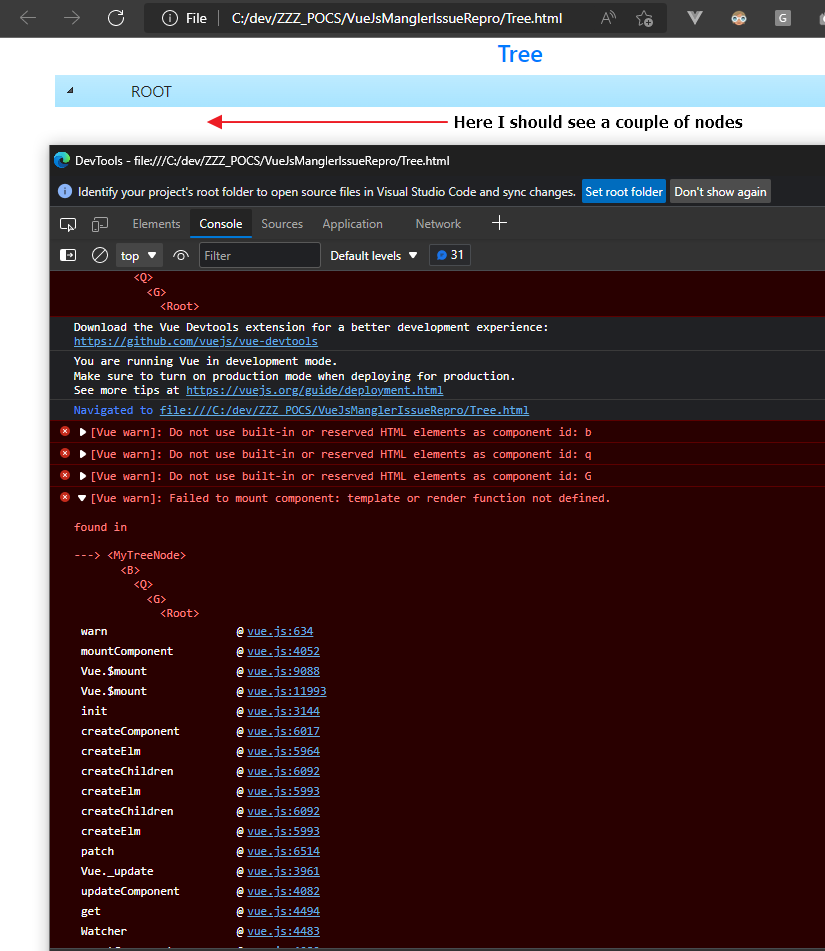

Vue JS Mangler Issue Repro POC
==============================

## Description

__UPDATE__: Fix found in this [VCC issue](https://github.com/vuejs/vue-class-component/issues/407)

__tnx__ a lot to 'skirtle' in Discord Vue Channel

This POC is to show an issue with VueJS 2.x (idk if is present also in Vue 3 but can be) that can happen when the minified code contains the component names (mangling) as
invalid names (like 'd' or '_a').

The issue is visible only with the VueJs in Dev Mode: in production mode the page can not work without any error in console.

## How to use this poc

There are 2 examples here:

- Tree: use a Tree component with recursion and slot techniques
- ParentChild is a simple Parent with a Child component

Open in browser the ~/Tree.html page to load the ~/pack/tree.js bundle example
Open in browser the ~/ParentChild.html page to load the ~/pack/ParentChild.js bundle example

You can check into the browser console the list of errors and what still works or not.

As you can see the Tree example will show you only 1 node (ROOT) so the example is 'broken'.

The ParentChild example presents the console errors but the page works correctly.

You can try to change the terser configuration in webpack.config.js and run the command `npm run-script build` this will create a new version of the bundles under ~/pack/ folder.

I proof the same problem with the VueCli Terser configuration that I found [here](https://github.com/vuejs/vue-cli/blob/9aeafc06bb7d4dab5dca55197f0287a921f7f14f/packages/%40vue/cli-service/lib/config/terserOptions.js)

Here a picture: \

## Rules for components name that I found

This is because there are 3 rules for component names
- they cannot be a valid html 5 tag name
- they cannot be a reserver word for VueJs ('component' and 'slot')
- they must follow the html 5 rules (the name must begin with a character etc..)

See: https://github.com/vuejs/vue/blob/7173ad42729fa0913c3e7de94d251341929ee7c6/src/core/util/options.ts#L283